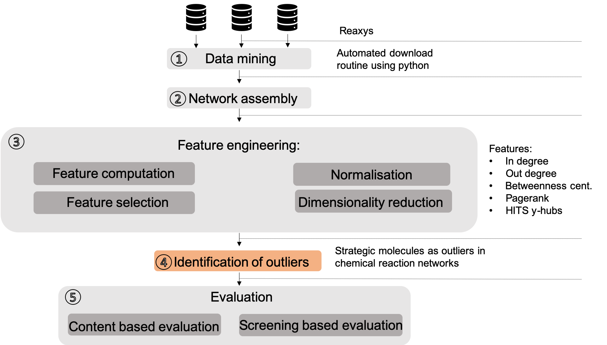

# Identification of strategic molecules

This repository contains the source code for the network-based pipeline for the identification of strategic molecules by [(Weber et al., 2019)][1]. Due to license agreements the datamining part is not part of this repository. The pipeline outlines steps 3 to 5 assuming a network-base data collection had been assembled previously. To cite from this work use (Weber et al., 2019). 

 

## 

[1]J. M. Weber, P. Lió, and A. Lapkin, Identification of strategic moleucles in large reaction networks for future circular supply chains, Journal of Global Optimization, vol. 71, no. 2, pp. 407–438, 2018.
